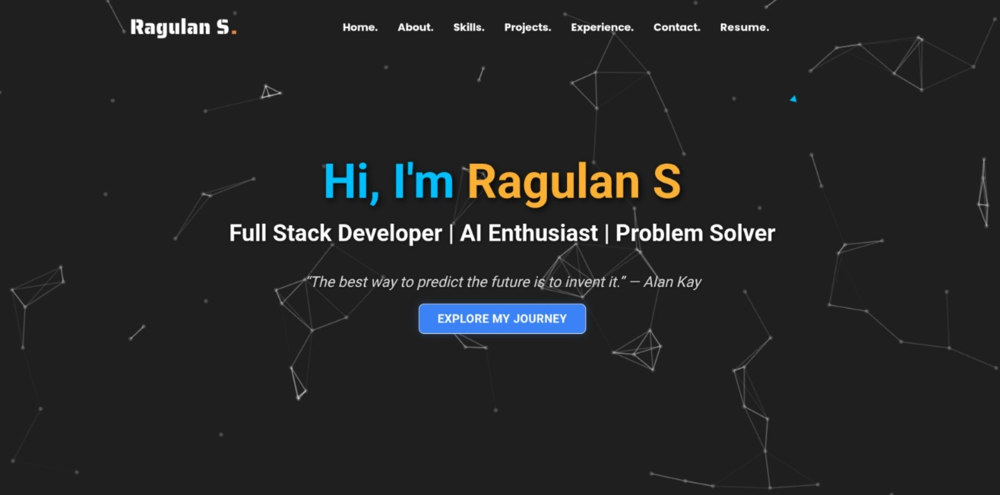
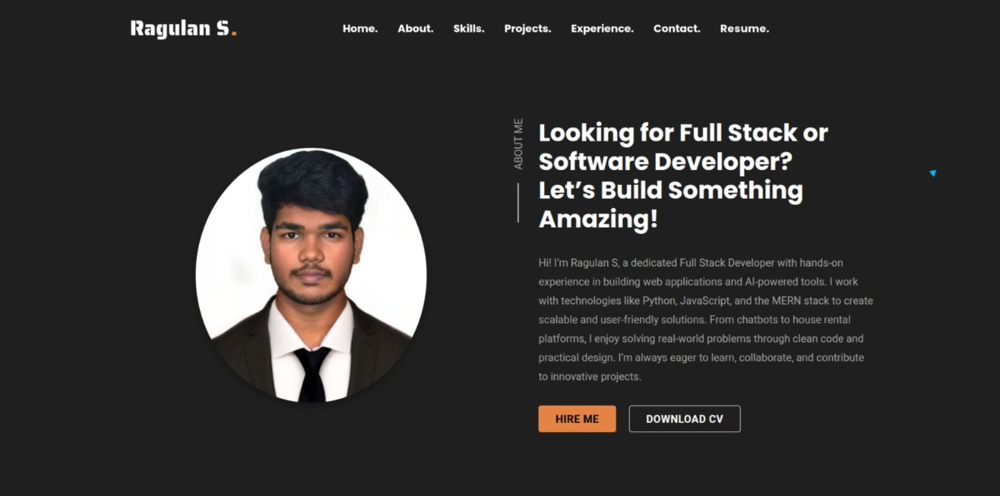
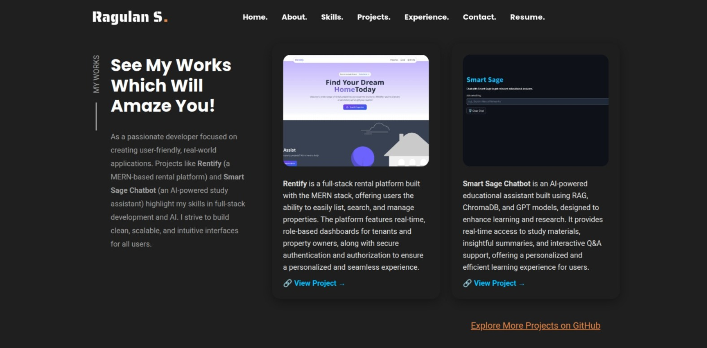

# 💼 Ragulan S - Developer Portfolio

Welcome to my developer portfolio! This repository highlights my key projects, technical skills, and experiences as a passionate software developer.

---

## ℹ️ Introduction

Hi, I’m **Ragulan S**, a Computer Science Engineering student focused on building impactful web applications and intelligent software solutions. This portfolio showcases my work in Full Stack Development and Artificial Intelligence, demonstrating my practical skills through real-world projects.

---

## 🔍 About This Portfolio

This portfolio features:

- A selection of personal and academic projects that highlight my expertise in MERN stack, Python-based AI, and frontend development.
- Detailed descriptions and live demos to explore my work.
- My technical skills, tools, and certifications that back my development journey.
- Achievements and internships that reflect my commitment to continuous learning.

---

## 🔗 Live Demo

Check out the live version of my portfolio here:  
👉 [Live Demo](https://ragulan.netlify.app/)

---

## 📸 Screenshots

| Homepage | About Section | Projects Section |
|----------|---------------|------------------|
|  |  |  |

---

## 🛠️ Skills

- **Languages**: Python, JavaScript, C, C++  
- **Frameworks & Tools**: React, Node.js, Express.js, Flask, Tailwind CSS, FastAPI, Docker  
- **Databases**: MongoDB, MySQL, ChromaDB  
- **AI/ML**: TensorFlow, Scikit-Learn, Sentence Transformers, RAG-based Retrieval  
- **Others**: Git, GitHub, Postman, Power BI, Streamlit  

---

## 🌟 Featured Projects

### 🔹 Smart Sage – AI Study Assistant Chatbot  
A Retrieval-Augmented Generation (RAG) chatbot providing educational answers using semantic search over documents, Wikipedia, and APIs.

- Built with: FastAPI, ChromaDB, OpenAI, Streamlit  
- Features: Voice input, Dark Mode, Chat history, PDF/Text ingestion  

### 🔹 Soft Skill Enhancement App  
An interactive platform to improve English communication skills through vocabulary lessons, pronunciation tests, and role-based dashboards.

- Built with: HTML, CSS, JavaScript  
- Features: Role-based login, progress tracking, admin panel  

### 🔹 Rentify – House Renting Platform  
A full-stack MERN app simplifying property listings and rental processes with admin controls and user authentication.

---

## 🏆 Achievements

- 🥈 2nd Place – Hexaware Hackathon (Cash prize: ₹25,000)  
- 🎓 AI Internship – Edufic Digital  
- 🎓 Full Stack Developer Internship – ADRIG AI Technologies  
- 🧠 Certified in MongoDB, Power BI, Digital Marketing  

---

## 📫 Contact Me

- **Email**: raguulan@gmail.com  
- **LinkedIn**: [linkedin.com/in/ragulan1525](https://linkedin.com/in/ragulan1525)  
- **GitHub**: [github.com/Ragulan1525](https://github.com/Ragulan1525)  

---

### 📌 Note

This portfolio is actively updated with new projects and skills as I grow as a developer.
